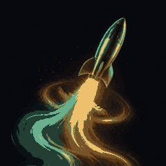
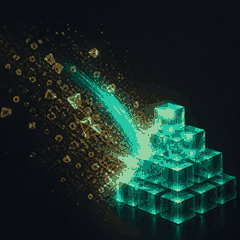
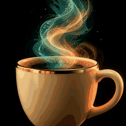

# Merge Cheer

[](https://github.com/YauhenBichel/merge-cheer/actions/workflows/ci.yml)
[](LICENSE)
[](CODE_OF_CONDUCT.md)

Comment a G-rated celebration GIF when a pull request merges.

No Giphy key. No checkout of the pull request. The action ships its own
GIF groups and, by default, picks one from the title (`fix` / `feat` /
`docs` / `test` / `refactor`, otherwise a general celebration). Pin a
group with `topic` when you want one mood every time.

## Install

```yaml
name: Celebrate merge
on:
  pull_request_target:
    types: [closed]
permissions:
  pull-requests: write
jobs:
  celebrate:
    if: github.event.pull_request.merged && github.event.pull_request.user.type != 'Bot'
    runs-on: ubuntu-latest
    steps:
      - uses: YauhenBichel/merge-cheer@v1
```

`pull_request_target` is what lets a fork merge get a comment. The action
never checks out the pull request head.

Pin a group:

```yaml
- uses: YauhenBichel/merge-cheer@v1
  with:
    topic: ship   # or party, space, magic, coffee, robot
```

`topic` is `auto` when unset. Allowed names: `auto`, `ship`, `fix`,
`docs`, `tests`, `cleanup`, `celebration`, `welcome`, `party`, `space`,
`magic`, `coffee`, `robot`. An unknown name falls back to `celebration`
and prints the list.

## Live demo

This README is the demo. The loops below are the files the Action
posts (open the file on GitHub to see them move).

| ship | fix | docs | tests |
| --- | --- | --- | --- |
|  |  |  |  |

| cleanup | celebration | welcome | party |
| --- | --- | --- | --- |
|  |  |  |  |

| space | magic | coffee | robot |
| --- | --- | --- | --- |
|  |  |  |  |

The in-the-wild demo is the next merged pull request on this
repository: [.github/workflows/celebrate.yml](.github/workflows/celebrate.yml)
runs `uses: ./` and comments one of these GIFs. No merge comment exists
yet — that workflow is what will write it.

## Topics

Each group is a folder of GIFs (`gifs/<group>/`). The action picks one
file in the group (stable for a given pull request number).

| `topic` | Title contains (when `auto`) | Preview |
| --- | --- | --- |
| `ship` | `feat`, `add `, `added`, `new `, `launch`, `ship:` |  |
| `fix` | `fix`, `bug`, `hotfix`, `patch` |  |
| `docs` | `doc`, `readme` |  |
| `tests` | `test`, `ci` |  |
| `cleanup` | `refactor`, `clean` |  |
| `celebration` | anything else |  |
| `welcome` | `welcome`, `good first`, first-time contributor |  |
| `party` | `party`, `congrats`, `woo`, `hooray`, `celebrate` |  |
| `space` | `cosmos`, `galaxy`, `orbit`, `planet` |  |
| `magic` | `magic`, `sparkle`, `wand`, `spell` |  |
| `coffee` | `coffee`, `latte`, `caffeine`, `espresso` |  |
| `robot` | `robot`, `android` |  |

`welcome` also wins on `auto` when GitHub marks the author
`FIRST_TIME_CONTRIBUTOR` or `FIRST_TIMER` and the title did not match
another group. It reuses the tests and celebration loops — no extra art.

Conventional title types (`fix`, `feat`, `docs`, `test`, `refactor`)
win before mood keywords, so `feat: add party mode` still ships.

Aliases: `launch` → `ship`, `nailed-it` → `fix`, `nice-work` → `docs`,
`ci` / `high-five` → `tests`, `refactor` → `cleanup`, `first` → `welcome`,
`congrats` / `woo` → `party`, `cosmos` / `galaxy` → `space`,
`sparkle` → `magic`, `latte` → `coffee`, `bot` → `robot`.

## Inputs

| Input | Default | What it does |
| --- | --- | --- |
| `github-token` | `${{ github.token }}` | Posts the comment |
| `topic` | `auto` | Group name, or `auto` to pick from the title |
| `giphy-api-key` | empty | Optional. When set, try a G-rated Giphy GIF first |
| `message` | `Merged — thank you @{author}.` | `{author}` becomes the PR author |
| `rating` | `g` | Giphy rating when a key is set |

```yaml
- uses: YauhenBichel/merge-cheer@v1
  with:
    topic: welcome
    giphy-api-key: ${{ secrets.GIPHY_API_KEY }}
    message: "Shipped. Thank you @{author}."
```

## Why this instead of a random Giphy Action

Most merge-GIF actions need a Giphy key and post whatever the API
returns. Merge Cheer works on a new repository with zero secrets, and
the fallback is a set of owned looping GIFs — not a pixel parrot.

## Security

- The title is read from an environment variable, not interpolated into a shell.
- The action does not check out code.
- It only comments. It does not push, merge, or approve.

See [SECURITY.md](SECURITY.md).

## Contributing

See [CONTRIBUTING.md](CONTRIBUTING.md). Please follow the
[Code of Conduct](CODE_OF_CONDUCT.md).

A good first change is another GIF in an existing group folder, or a
title keyword for a group, plus a test. Open issues:
[`good first issue`](https://github.com/YauhenBichel/merge-cheer/labels/good%20first%20issue).

```bash
python3 -m unittest discover -s tests -q
```

## Publish a release

This folder is the Action. On GitHub: create a **public** repository
named `merge-cheer`, push `main`, then tag `v1`. Marketplace listing is
**Settings → actions → publish** after that tag exists.

## Rebuild the GIFs

```bash
python3 -m pip install -r requirements-dev.txt
python3 scripts/make_gifs.py
```

Writes `gifs/<group>/<name>.gif`. Keep each file under 180 KB. A group
may hold several files; `alt.gif` is the same still with the pulse
inverted. Mood groups (`party`, `space`, `magic`, `coffee`, `robot`)
each ship two original stills.

## License

[MIT](LICENSE). The GIFs are original stills animated for this Action.
See [NOTICE](NOTICE).

## Contributors

Thank you to everyone who has helped.

<!-- readme: contributors,bots/- -start -->
<!-- readme: contributors,bots/- -end -->

Filled from GitHub commits (bots omitted). Live demo: [readme-contributors](https://github.com/YauhenBichel/readme-contributors#live-demo).
